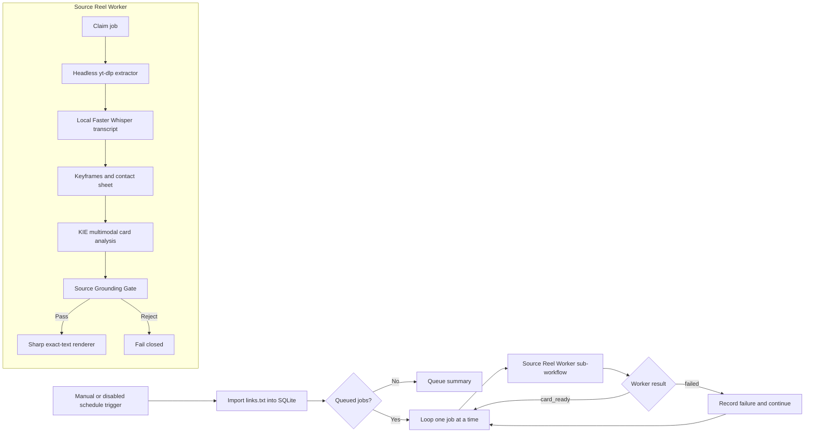

# Source Reel to Grounded Card Pipeline Implementation Plan

> **For agentic workers:** REQUIRED SUB-SKILL: Use superpowers:subagent-driven-development (recommended) or superpowers:executing-plans to implement this plan task-by-task. Steps use checkbox (`- [ ]`) syntax for tracking.

**Goal:** Turn an append-only queue of owned YouTube/Instagram links into downloaded source bundles containing video, post caption, transcript, representative frames, a source-grounded one-card specification, and an exact-text 1080×1920 PNG.

**Architecture:** Keep the existing RSS/ranking workflows unchanged. Extend the tested Python media extractor with a headless JSON CLI, then add a separate n8n orchestrator that imports queue links, processes one item at a time, transcribes locally with Faster Whisper, analyzes a contact sheet plus transcript, enforces source evidence, and renders Korean text deterministically with Sharp over an owned source frame.

**Tech Stack:** n8n 2.26.8, Node.js 24, Python 3.12+, yt-dlp, FFmpeg, Faster Whisper 1.2.1/CTranslate2 4.7.2 with CUDA, KIE multimodal chat, Sharp, SQLite, JSON Schema.

---

## 1. Locked decisions

- The source accounts are owned/authorized pharmacist channels.
- This is a new pipeline. Do not modify the two current RSS/rank workflows.
- The queue is an append-only UTF-8 text file. Re-reading it is safe because SQLite provides deduplication.
- A plain line contains one URL. An optional channel hint is allowed: `[haru_pharmacist] URL` or `[health_longevity] URL`.
- One source link creates one work bundle and one 1080×1920 card image.
- The card contains one core message and at most four supporting facts. Extra source detail remains in `caption.txt` and `transcript.json`; it is not squeezed into the image.
- Korean text is never painted by an image model. Sharp/SVG renders exact strings.
- The default background is a representative frame from the owned source video. AI-generated background is outside this first implementation.
- A claim can appear on the card only when it has at least one caption or transcript evidence ID.
- The first release stops at `card.png` and a review manifest. YouTube publishing is not connected until the review output is accepted.

## 2. Runtime layout

```text
G:\owned-media\shorts\
  00_링크큐\
    links.txt
  10_작업\
    haru_pharmacist\
      instagram_ABC123\
        manifest.json
        source.json
        caption.txt
        source.mp4
        audio.wav
        transcript.json
        keyframes\
          frame_001.jpg
          frame_002.jpg
        contact-sheet.jpg
        analysis-request.json
        analysis-response.json
        card-spec.json
        card.png
    health_longevity\
      youtube_dQw4w9WgXcQ\
        manifest.json
        source.json
        caption.txt
        source.mp4
        audio.wav
        transcript.json
        keyframes\
        contact-sheet.jpg
        analysis-request.json
        analysis-response.json
        card-spec.json
        card.png
  90_실패\
    instagram_BAD123.json
```

Local operational state stays out of Google Drive:

```text
C:\dev\n8n-youtube-shorts-automation\data\source-reel-pipeline.sqlite
```

The database state machine is:

```text
queued → downloading → downloaded → transcribing → analyzing
       → grounding_review → rendering → card_ready

Any stage → failed; a manual retry moves failed → queued.
Unknown creator mapping → needs_channel_mapping.
```

The unique identity is `platform + platform_media_id`. A URL hash is used only before yt-dlp reveals the platform media ID.

## 3. n8n topology



Create these workflows:

- `workflows/source_reel_card_orchestrator.json`
- `workflows/source_reel_card_worker.json`
- `workflows/source_grounding_gate.json`

## 4. Data contracts

### `source.json`

```json
{
  "schema_version": "1.0",
  "source_id": "instagram_ABC123",
  "platform": "instagram",
  "platform_media_id": "ABC123",
  "source_url": "https://www.instagram.com/reel/ABC123/",
  "canonical_url": "https://www.instagram.com/reel/ABC123/",
  "creator_id": "creator-account-id",
  "creator_name": "운영 약사 채널",
  "channel_id": "haru_pharmacist",
  "title": "원본 제목",
  "caption": "원본 게시물 캡션 전체",
  "duration_seconds": 42.3,
  "upload_date": "2026-07-01",
  "media_path": "G:/owned-media/shorts/10_작업/haru_pharmacist/instagram_ABC123/source.mp4"
}
```

### `transcript.json`

```json
{
  "schema_version": "1.0",
  "language": "ko",
  "model": "large-v3",
  "segments": [
    { "id": "t0001", "start": 0.0, "end": 4.8, "text": "영상의 첫 발화" },
    { "id": "t0002", "start": 4.8, "end": 9.7, "text": "다음 발화" }
  ],
  "full_text": "영상의 첫 발화 다음 발화"
}
```

Caption evidence is split into sentence IDs `c0001`, `c0002`, and transcript evidence keeps `t0001`, `t0002`.

### `card-spec.json`

```json
{
  "schema_version": "1.0",
  "source_id": "instagram_ABC123",
  "channel_id": "haru_pharmacist",
  "card": {
    "kicker": "약사가 알려주는 생활 정보",
    "title": "한 장에 담을 핵심 제목",
    "subtitle": "원본 영상의 맥락을 보충하는 한 문장",
    "facts": [
      {
        "heading": "핵심 항목",
        "detail": "원인과 결과가 이어지는 완전한 설명",
        "evidence_ids": ["t0002", "c0001"]
      }
    ],
    "action": "시청자가 바로 해볼 수 있는 행동",
    "caveat": "원본에서 말한 예외나 주의사항"
  },
  "visual": {
    "template": "owned_source_photo_fact_card_v1",
    "keyframe_file": "keyframes/frame_004.jpg",
    "subject_position": "right",
    "overlay_position": "left",
    "accent_color": "#0F766E"
  },
  "grounding": {
    "decision": "pending",
    "issues": []
  }
}
```

Limits enforced by schema and gate:

- `kicker`: 2–18 Korean characters
- `title`: 8–28 characters
- `subtitle`: 12–45 characters
- `facts`: 1–4
- `heading`: 2–12 characters
- `detail`: 16–42 characters
- `action`: 10–38 characters
- every fact has 1–3 valid evidence IDs
- any percentage, dose, count, or exact number must occur verbatim in referenced evidence

## 5. File map

### Existing extractor repository

Root:
`C:\dev\etc\youtube-instagram-media-extractor\프로그램 구성 파일\개발 파일`

- Modify `src/youtube_instagram_media_extractor/downloader.py`: return normalized source metadata with the downloaded file.
- Create `src/youtube_instagram_media_extractor/manifest.py`: normalize yt-dlp info and write `source.json`/`caption.txt` atomically.
- Create `src/youtube_instagram_media_extractor/batch_cli.py`: headless one-URL JSON interface.
- Modify `src/youtube_instagram_media_extractor/__main__.py`: route `batch` arguments without opening Tk.
- Modify `requirements.txt`: preserve existing packages; no transcription dependency belongs in this repository.
- Create `tests/test_manifest.py`.
- Create `tests/test_batch_cli.py`.
- Modify `tests/test_downloader.py` for `DownloadResult.source_metadata`.

### n8n repository

Root: `C:\dev\n8n-youtube-shorts-automation`

- Create `config/source-reel-pipeline.json`: paths, model, frame count, retry limits.
- Create `config/source-channels.json`: two brand/channel profiles and creator aliases.
- Create `schemas/source-job.schema.json`.
- Create `schemas/source-card-spec.schema.json`.
- Create `scripts/source-reel-queue.mjs`: queue import, claim, transition, retry, summary.
- Create `scripts/transcribe-source-media.py`: Faster Whisper JSON transcript.
- Create `scripts/extract-source-keyframes.mjs`: scene frames and contact sheet.
- Create `scripts/render-source-card.mjs`: exact Korean text renderer.
- Create `scripts/install-source-reel-workflows.mjs`: backup DB, install/publish three workflows.
- Create `scripts/verify-source-reel-workflows.mjs`.
- Create `scripts/verify-source-grounding-gate.mjs`.
- Create `scripts/smoke-source-reel-pipeline.mjs`.
- Create the three workflow JSON files listed above.

## Task 1: Create queue configuration, schema, and SQLite state machine

**Files:**
- Create: `config/source-reel-pipeline.json`
- Create: `config/source-channels.json`
- Create: `schemas/source-job.schema.json`
- Create: `scripts/source-reel-queue.mjs`
- Test: `scripts/verify-source-reel-queue.mjs`

`config/source-channels.json` starts with this exact mapping; later creator IDs discovered from owned links are appended to `creator_aliases`:

```json
{
  "haru_pharmacist": {
    "display_name": "하루건강약사",
    "creator_aliases": ["하루건강약사", "@하루건강약사"],
    "kicker": "약사가 알려주는 생활 정보",
    "accent_color": "#0F766E"
  },
  "health_longevity": {
    "display_name": "건강장수비결",
    "creator_aliases": ["건강장수비결", "@건강장수비결"],
    "kicker": "건강하게 오래 사는 생활 정보",
    "accent_color": "#7C2D12"
  }
}
```

- [ ] **Step 1: Write failing queue tests**

Tests must prove:

```js
assert.equal(canonicalize('https://www.instagram.com/reel/ABC123/?utm_source=x'), 'https://www.instagram.com/reel/ABC123/');
assert.equal(canonicalize('https://youtu.be/dQw4w9WgXcQ?t=3'), 'https://www.youtube.com/watch?v=dQw4w9WgXcQ');
assert.equal(importedJobs.length, 2);
assert.equal(secondImport.inserted, 0);
assert.equal(claimed.status, 'downloading');
assert.throws(() => transition('queued', 'card_ready'), /invalid transition/);
```

- [ ] **Step 2: Run tests and verify red state**

Run:

```powershell
node scripts/verify-source-reel-queue.mjs
```

Expected: failure because `scripts/source-reel-queue.mjs` does not exist.

- [ ] **Step 3: Implement the queue contract**

Use these commands:

```text
node scripts/source-reel-queue.mjs import
node scripts/source-reel-queue.mjs claim --limit 1
node scripts/source-reel-queue.mjs transition --job-id 1 --to downloaded --artifact source.json
node scripts/source-reel-queue.mjs fail --job-id 1 --stage downloading --error-json eyJjb2RlIjoibG9naW5fcmVxdWlyZWQifQ==
node scripts/source-reel-queue.mjs retry --job-id 1
node scripts/source-reel-queue.mjs summary
```

Every command prints one JSON object to stdout and no human log text. Use SQLite `BEGIN IMMEDIATE` while claiming so two runs cannot claim the same row.

- [ ] **Step 4: Run queue tests**

Expected: `PASS: source reel queue canonicalization, dedupe, and transitions`.

- [ ] **Step 5: Commit**

```powershell
git add config schemas scripts/source-reel-queue.mjs scripts/verify-source-reel-queue.mjs
git commit -m "feat: add durable source reel queue"
```

## Task 2: Add a headless metadata-and-caption extractor CLI

**Files:**
- Modify: `C:\dev\etc\youtube-instagram-media-extractor\프로그램 구성 파일\개발 파일\src\youtube_instagram_media_extractor\downloader.py`
- Create: `C:\dev\etc\youtube-instagram-media-extractor\프로그램 구성 파일\개발 파일\src\youtube_instagram_media_extractor\manifest.py`
- Create: `C:\dev\etc\youtube-instagram-media-extractor\프로그램 구성 파일\개발 파일\src\youtube_instagram_media_extractor\batch_cli.py`
- Modify: `C:\dev\etc\youtube-instagram-media-extractor\프로그램 구성 파일\개발 파일\src\youtube_instagram_media_extractor\__main__.py`
- Test: `C:\dev\etc\youtube-instagram-media-extractor\프로그램 구성 파일\개발 파일\tests\test_manifest.py`
- Test: `C:\dev\etc\youtube-instagram-media-extractor\프로그램 구성 파일\개발 파일\tests\test_batch_cli.py`

- [ ] **Step 1: Add failing normalized metadata tests**

Use a mocked yt-dlp record containing `id`, `extractor_key`, `webpage_url`, `uploader_id`, `uploader`, `description`, `duration`, `upload_date`, and `thumbnail`. Assert that `caption.txt` preserves the full description and `source.json` uses forward-slash absolute paths.

- [ ] **Step 2: Run extractor tests and verify red state**

```powershell
$env:PYTHONDONTWRITEBYTECODE='1'
python -m pytest -p no:cacheprovider tests/test_manifest.py tests/test_batch_cli.py -q
```

Expected: collection/import failure for the new modules.

- [ ] **Step 3: Implement `SourceMetadata` and atomic manifest writes**

Add this dataclass contract:

```python
@dataclass
class SourceMetadata:
    source_id: str
    platform: str
    platform_media_id: str
    source_url: str
    canonical_url: str
    creator_id: str
    creator_name: str
    title: str
    caption: str
    duration_seconds: float
    upload_date: str
    thumbnail_url: str
```

Write JSON through `path.with_suffix('.tmp')`, flush, then `replace(path)`. Never write cookies, request headers, formats, signed media URLs, or raw yt-dlp dumps into the manifest.

- [ ] **Step 4: Implement the one-URL CLI**

Command:

```powershell
python -m youtube_instagram_media_extractor.batch_cli download `
  --url "https://www.instagram.com/reel/ABC123/" `
  --output-dir "G:\owned-media\shorts\10_작업\unmapped\instagram_ABC123" `
  --video-quality 1080 `
  --include-audio `
  --cookie-browser chrome `
  --json
```

Success stdout:

```json
{"ok":true,"source_json":"G:/owned-media/shorts/10_작업/unmapped/instagram_ABC123/source.json","caption_file":"G:/owned-media/shorts/10_작업/unmapped/instagram_ABC123/caption.txt","media_file":"G:/owned-media/shorts/10_작업/unmapped/instagram_ABC123/source.mp4"}
```

Failure stdout uses `{"ok":false,"stage":"download","error_code":"login_required","message":"브라우저 로그인 쿠키가 필요합니다."}` and exit code 1.

- [ ] **Step 5: Run all extractor tests**

Expected: current 32 tests plus new tests pass.

- [ ] **Step 6: Commit in the extractor repository**

```powershell
git add "프로그램 구성 파일/개발 파일/src" "프로그램 구성 파일/개발 파일/tests"
git commit -m "feat: add headless source manifest extraction"
```

## Task 3: Add local Korean transcription

**Files:**
- Create: `scripts/transcribe-source-media.py`
- Test: `scripts/test_transcribe_source_media.py`

- [ ] **Step 1: Write failing transcript contract tests**

Mock `WhisperModel.transcribe()` and assert segment IDs, millisecond-safe floats, whitespace cleanup, and atomic output.

- [ ] **Step 2: Run tests and verify red state**

```powershell
python -m pytest -p no:cacheprovider scripts/test_transcribe_source_media.py -q
```

- [ ] **Step 3: Implement CUDA-first transcription**

Command:

```powershell
python scripts/transcribe-source-media.py `
  --input "G:\owned-media\shorts\10_작업\haru_pharmacist\instagram_ABC123\source.mp4" `
  --output "G:\owned-media\shorts\10_작업\haru_pharmacist\instagram_ABC123\transcript.json" `
  --model large-v3 `
  --language ko `
  --device cuda `
  --compute-type float16
```

Use `vad_filter=True`, `beam_size=5`, `condition_on_previous_text=True`. If CUDA initialization fails, retry once with `device='cpu'` and `compute_type='int8'`. Do not silently change models.

- [ ] **Step 4: Run transcript tests**

Expected: `PASS` and no model download during mocked tests.

- [ ] **Step 5: Commit**

```powershell
git add scripts/transcribe-source-media.py scripts/test_transcribe_source_media.py
git commit -m "feat: add local Korean source transcription"
```

## Task 4: Extract representative frames and contact sheet

**Files:**
- Create: `scripts/extract-source-keyframes.mjs`
- Test: `scripts/verify-source-keyframes.mjs`

- [ ] **Step 1: Write failing fixture tests**

Generate a 12-second color-change fixture with FFmpeg. Assert 6–8 JPEG frames, unique timecodes, and a 1600×1800-or-smaller contact sheet.

- [ ] **Step 2: Implement deterministic selection**

Run FFmpeg scene detection at `scene=0.28`. Always include frames nearest 5%, 50%, and 95% of duration. Deduplicate frames within 750 ms. If fewer than six remain, fill evenly spaced timecodes. Limit to eight frames.

Command:

```powershell
$json = '{"media_path":"G:/owned-media/shorts/10_작업/haru_pharmacist/instagram_ABC123/source.mp4","keyframe_dir":"G:/owned-media/shorts/10_작업/haru_pharmacist/instagram_ABC123/keyframes","contact_sheet_path":"G:/owned-media/shorts/10_작업/haru_pharmacist/instagram_ABC123/contact-sheet.jpg","max_frames":8}'
$payload = [Convert]::ToBase64String([Text.Encoding]::UTF8.GetBytes($json))
node scripts/extract-source-keyframes.mjs $payload
```

The payload contains `media_path`, `keyframe_dir`, `contact_sheet_path`, and `max_frames: 8`.

- [ ] **Step 3: Run keyframe tests**

Expected: `PASS: representative source frames and contact sheet`.

- [ ] **Step 4: Commit**

```powershell
git add scripts/extract-source-keyframes.mjs scripts/verify-source-keyframes.mjs
git commit -m "feat: extract source reel contact sheets"
```

## Task 5: Build and enforce the source-grounded card specification

**Files:**
- Create: `schemas/source-card-spec.schema.json`
- Create: `workflows/source_grounding_gate.json`
- Create: `scripts/verify-source-grounding-gate.mjs`

- [ ] **Step 1: Write failing gate behavior tests**

Required cases:

```text
supported fact with t0002 → pass
fact with missing t9999 → reject: missing_evidence
85% absent from evidence → reject: unsupported_number
detail ending in "압력 부담" → reject: vague_fragment
five facts → reject: card_overflow
AI review API error → reject: review_api_error
```

- [ ] **Step 2: Create the active sub-workflow**

Nodes:

```text
When Executed by Another Workflow
→ Normalize Caption Evidence
→ Deterministic Source Grounding
→ Deterministic Passed?
  true → Independent KIE Claude Grounding Review
       → Parse Grounding Review
  false → Return Grounding Rejection
```

The independent reviewer receives only `card-spec`, caption sentences, transcript segments, and source metadata. Prompt rule: “Do not improve facts. Remove or reject anything not directly supported by the supplied evidence.”

- [ ] **Step 3: Run gate tests**

Expected: all six cases pass.

- [ ] **Step 4: Commit**

```powershell
git add schemas/source-card-spec.schema.json workflows/source_grounding_gate.json scripts/verify-source-grounding-gate.mjs
git commit -m "feat: add source grounding quality gate"
```

## Task 6: Render exact Korean text over an owned source frame

**Files:**
- Create: `scripts/render-source-card.mjs`
- Test: `scripts/verify-source-card-render.mjs`

- [ ] **Step 1: Write failing renderer tests**

Assert:

```text
output is PNG
dimensions are exactly 1080×1920
all escaped Korean strings occur in generated SVG before rasterization
right-positioned subject selects left overlay template
four facts fit; five facts are rejected
missing keyframe fails closed
```

- [ ] **Step 2: Implement `owned_source_photo_fact_card_v1`**

Composition:

- source frame fills 1080×1920 with cover crop
- dark-to-transparent gradient behind copy
- kicker at y=230
- title at y=300, maximum two lines
- subtitle below title
- 1–4 fact rows in the center safe zone
- action/caveat above y=1450
- bottom 25% and rightmost 10% contain no required text
- use `Malgun Gothic`/`맑은 고딕` with deterministic line breaks calculated before SVG generation

Command:

```powershell
$json = '{"card_spec_path":"G:/owned-media/shorts/10_작업/haru_pharmacist/instagram_ABC123/card-spec.json","output_path":"G:/owned-media/shorts/10_작업/haru_pharmacist/instagram_ABC123/card.png"}'
$payload = [Convert]::ToBase64String([Text.Encoding]::UTF8.GetBytes($json))
node scripts/render-source-card.mjs $payload
```

Success stdout includes `card_path`, `width`, `height`, and `sha256`.

- [ ] **Step 3: Run renderer tests**

Expected: `PASS: exact-text source card renderer`.

- [ ] **Step 4: Commit**

```powershell
git add scripts/render-source-card.mjs scripts/verify-source-card-render.mjs
git commit -m "feat: render grounded source photo cards"
```

## Task 7: Build the n8n orchestrator and worker

**Files:**
- Create: `workflows/source_reel_card_orchestrator.json`
- Create: `workflows/source_reel_card_worker.json`
- Create: `scripts/install-source-reel-workflows.mjs`
- Create: `scripts/verify-source-reel-workflows.mjs`

- [ ] **Step 1: Write failing structural tests**

Assert the orchestrator imports the queue, loops sequentially, calls the worker, and records a summary. Assert the worker calls the extractor, transcriber, keyframe helper, multimodal analysis, grounding gate, renderer, and final transition.

- [ ] **Step 2: Build the worker**

Worker input:

```json
{
  "job_id": 1,
  "url": "https://www.instagram.com/reel/ABC123/",
  "channel_hint": null,
  "output_root": "G:/owned-media/shorts"
}
```

Upload the contact sheet through `POST https://kieai.redpandaai.co/api/file-base64-upload`. Analyze it through `POST https://api.kie.ai/gpt-5-2/v1/chat/completions` with model `gpt-5-2`, the returned image URL, the full post caption, and transcript segments. Reuse the existing KIE credential. The response must be strict `card-spec.json`; the parser rejects prose, markdown fences, missing evidence IDs, and more than four facts.

Every local helper runs with `spawnSync`, `windowsHide: true`, explicit timeout, bounded buffer, and argument arrays. Never assemble a shell string.

- [ ] **Step 3: Build the orchestrator**

Default trigger is manual. Include a disabled 10-minute schedule trigger. Loop batch size is one. A failed job is recorded and the loop continues; it must not stop later links.

- [ ] **Step 4: Implement safe installation**

`scripts/install-source-reel-workflows.mjs` must:

1. `VACUUM INTO` a timestamped n8n DB backup.
2. Upsert the three workflow drafts.
3. Insert workflow history rows.
4. Publish the two callable sub-workflows with `activeVersionId` and `workflow_published_version`.
5. Leave the orchestrator inactive/manual.
6. Preserve all existing workflow rows.

- [ ] **Step 5: Run structural and live DB tests**

Expected:

```text
PASS: source reel orchestrator and worker structure
PASS: callable source workflows are published
PASS: existing three workflow IDs unchanged
```

- [ ] **Step 6: Commit**

```powershell
git add workflows/source_* scripts/install-source-reel-workflows.mjs scripts/verify-source-reel-workflows.mjs
git commit -m "feat: add source reel card n8n pipeline"
```

## Task 8: End-to-end smoke verification

**Files:**
- Create: `scripts/smoke-source-reel-pipeline.mjs`
- Modify: `README.md`

- [ ] **Step 1: Add an offline fixture smoke test**

Use a generated local MP4 and mocked yt-dlp/KIE responses. Verify the final work bundle contains all 11 required artifacts and `manifest.status === 'card_ready'`.

- [ ] **Step 2: Run one owned-link dry run**

The smoke script reads the first active URL from `G:\owned-media\shorts\00_링크큐\links.txt`. It downloads and analyzes the item but never uploads to YouTube.

- [ ] **Step 3: Inspect output**

Verify:

```text
source.mp4 plays
caption.txt equals the post caption
transcript.json has timestamped Korean segments
contact-sheet.jpg represents the video
every card fact has valid evidence IDs
card.png is 1080×1920 and Korean text is exact
duplicate rerun creates no second job
```

- [ ] **Step 4: Run the full suite**

```powershell
$env:PYTHONDONTWRITEBYTECODE='1'
python -m pytest -p no:cacheprovider -q
node scripts/verify-source-reel-queue.mjs
node scripts/verify-source-keyframes.mjs
node scripts/verify-source-grounding-gate.mjs
node scripts/verify-source-card-render.mjs
node scripts/verify-source-reel-workflows.mjs
node scripts/smoke-source-reel-pipeline.mjs --offline
git diff --check
```

Expected: every command exits 0.

- [ ] **Step 5: Document operator use**

README operator flow:

```text
1. Paste owned URLs into 00_링크큐\links.txt, one per line.
2. Open n8n and run Source Reel Card Orchestrator.
3. Review card.png under 10_작업\haru_pharmacist\instagram_ABC123.
4. Read manifest.json for failures or evidence mapping.
5. Use source-reel-queue.mjs retry only after correcting the recorded cause.
```

- [ ] **Step 6: Commit**

```powershell
git add README.md scripts/smoke-source-reel-pipeline.mjs
git commit -m "test: verify source reel card pipeline end to end"
```

## 6. Acceptance criteria

- Multiple pasted URLs are imported without duplication.
- A failed link does not block later links.
- Instagram login fallback behavior matches the existing GUI extractor.
- Every completed bundle contains video, full caption, metadata, transcript, contact sheet, card spec, and card PNG.
- The card contains no statement without valid source evidence IDs.
- Unsupported numeric claims are rejected.
- Korean text is deterministic and exact.
- Current RSS/rank workflows remain byte-for-byte untouched during installation.
- No YouTube upload occurs in this release.

## 7. Self-review

- Spec coverage: bulk queue, existing extractor reuse, video and caption download, video information extraction, one-scene image production, two-channel mapping, deduplication, retries, and n8n separation are covered.
- Scope split: ingestion/transcription becomes independently testable before card analysis/rendering; both are joined only in Task 7.
- Type consistency: `source_id`, `channel_id`, `evidence_ids`, `card-spec.json`, and state names are identical across contracts and tasks.
- Placeholder scan: no implementation step depends on an unspecified service or unnamed file. The first real URL is intentionally read from the operator-owned queue at smoke-test time.
